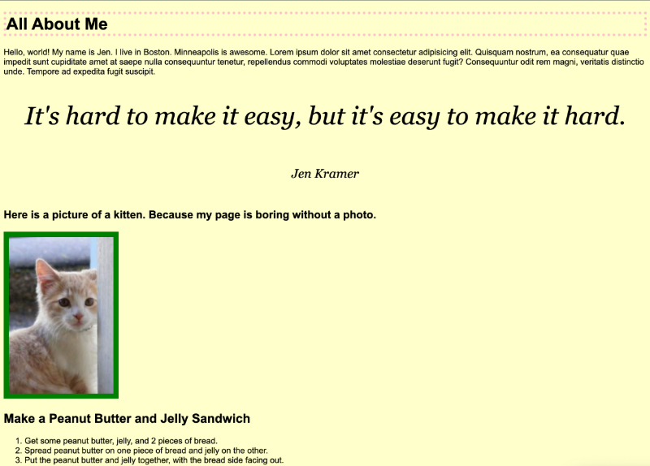

# Frontend Masters Bootcamp: Introduction to CSS

## Overview

This repository contains the files created while following along with the [Frontend Masters Introduction to CSS Course](https://frontendmasters.com/bootcamp/introduction-css/). This project is part of the [Frontend Masters Bootcamp](https://frontendmasters.com/bootcamp/) and is designed to demonstrate the basic concepts of CSS.

**Note:** This is an unfinished class project meant for learning purposes only. It is not intended to be interesting or complete.

## Screenshot

## Live Site

You can find the live version of the project [here]()

## Project Structure

- **index.html**: The main HTML file containing the structure and content of the web page.
- **css/style.css**: The CSS file containing the styles for the HTML elements.

## Key Features

- Basic HTML and CSS setup.
- Demonstrates the use of CSS for styling text, images, and layout.
- Includes examples of different HTML tags and CSS properties.

## Usage

To view the project, open `index.html` in a web browser. This will display the web page with the applied CSS styles.

## Acknowledgments

This project was developed as part of the Frontend Masters Bootcamp, following the Introduction to CSS course led by Jen Kramer.

## Links

- [Frontend Masters Bootcamp](https://frontendmasters.com/bootcamp/)
- [Introduction to CSS Course](https://frontendmasters.com/bootcamp/introduction-css/)
